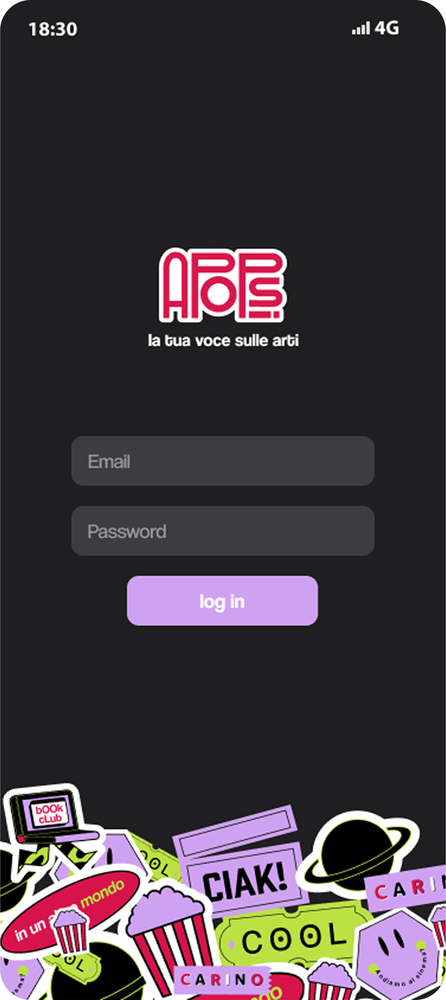
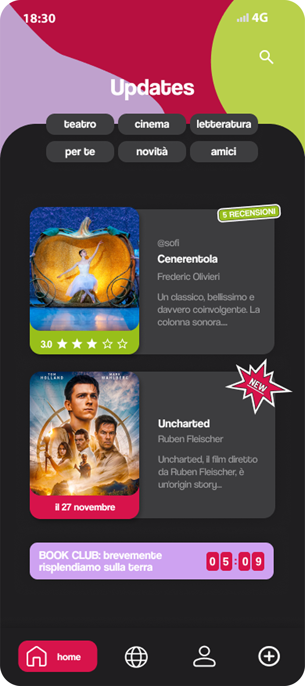
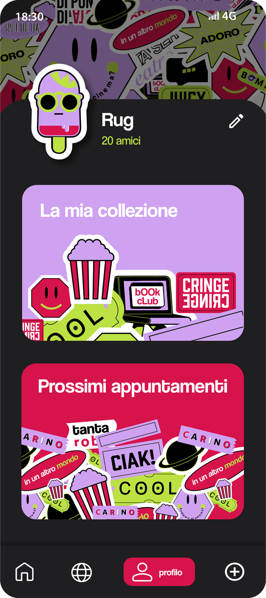
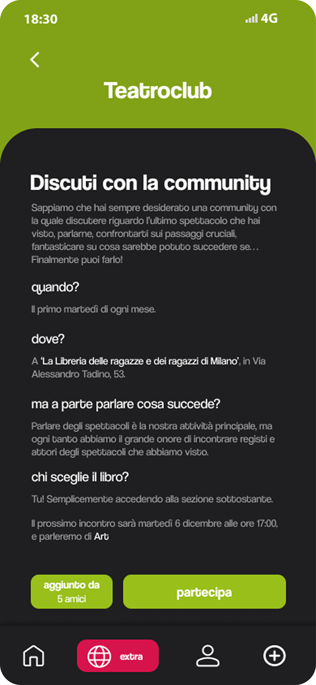
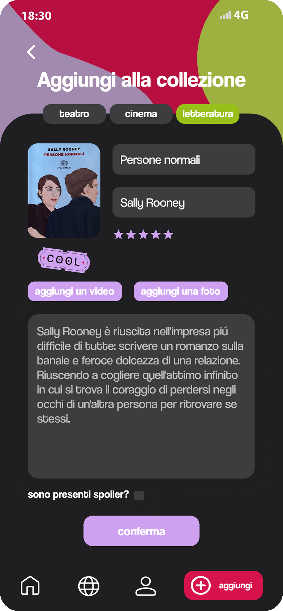
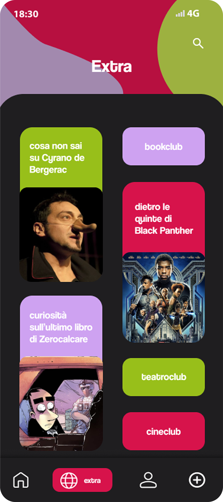

# APOPSI

## Overview
**Apopsi** is a cross-platform mobile application designed to engage young people with culture by creating a dynamic and interactive community.  
Users can explore and discuss various cultural topics, including literature, cinema, and theater, while sharing their experiences, reviews, and recommendations.

## Features
- **Community Updates**: Stay informed about the latest cultural events, books, and films.
- **Book & Film Collection**: Users can add books and movies to their collection, rate them, and write reviews.
- **Camera Integration**: Scan book covers to instantly retrieve information.
- **Event Synchronization**: Firebase-based real-time synchronization for cultural events and discussions.
- **Social Interaction**: Engage with friends, join clubs, and participate in discussions.

## Technology Stack
- **Frontend**: Flutter (cross-platform development)
- **Backend**: Firebase (real-time data storage and synchronization)
- **Camera Access**: Integrated for book cover scanning
- **UI/UX Design**: Designed using Figma for prototyping and user experience study

## Screenshots

### **1. Login Screen**  

---

### **2. Updates Section**  

---

### **3. Book Scanner**  

---

### **4. Profile Section**  

---

### **5. Community Interaction (Theater Club)**  

---

### **6. Adding a Book to the Collection**  

---

### **7. Extra Cultural Insights**  

---

### **8. Book Details & Review**  

---

## Future Improvements
- **AI-based Recommendations**: Personalized suggestions for books, movies, and events.
- **Gamification**: Badges and achievements for active participation.
- **Offline Mode**: Browse saved content without an internet connection.

## Author
Developed by **Andrea Bolis**, an AI and automation expert passionate about data-driven decision-making and technology-driven cultural engagement.
